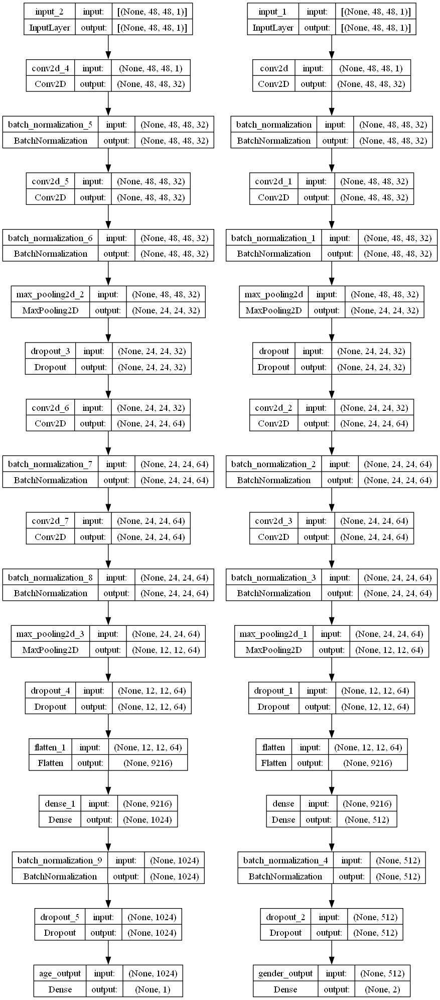

## Gender and Age Detection System

This project consists of two main components: the training of a machine learning model for gender and age detection (Gender_age_train_final.ipynb), and its application to detect gender and age from images and video streams (inference_notebook_final.ipynb).

## For Testing purposes

 The inference notebook (inference_notebook_final.ipynb) utilizes the trained model to perform gender and age detection on new images and video streams. It is structured with clear markdown cells guiding you through the process.

 ### For Image Input
 Test Images Folder: Ensure all test images are stored in a folder named "test_images". The notebook provides instructions for loading these images and applying the model to detect gender and age.

 ### For Video Stream

 - **Output CSV:** The notebook processes video streams, producing a CSV file named "output.csv" that contains detected genders and age estimates.
  
- **Performance Metrics:** Utilizes Mean Squared Error (MSE) for age prediction evaluation and accuracy for gender classification assessment.

## Training the Model (Gender_age_train.ipynb)

### Model Architecture: 
Architecture contains CNN with two blocks and and then flattening and adding dense layers, both for age and gender layers. Total Trainable parameters are 14293187 (54.52 MB) and Non-trainable parameters are 3840 (15.00 KB).
- **Flowchart:**

### Model metrics:
 Age output is checked from MSE and gender output is checked from accuracy.
 
 After the model is trained, it is saved as a h5 file format named 'gen_age_final'

 ### Machine specifications:
 The model is trained on a GPU: Nvidia GeForce GTX 1650 4 GB

 
 
 ## Getting Started
 Unzip the UTKFace dataset first to run the training notebook. To use the trained model directly, you can use gen_age_final.h5 file. 
